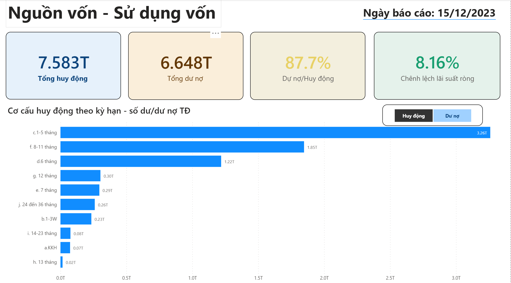
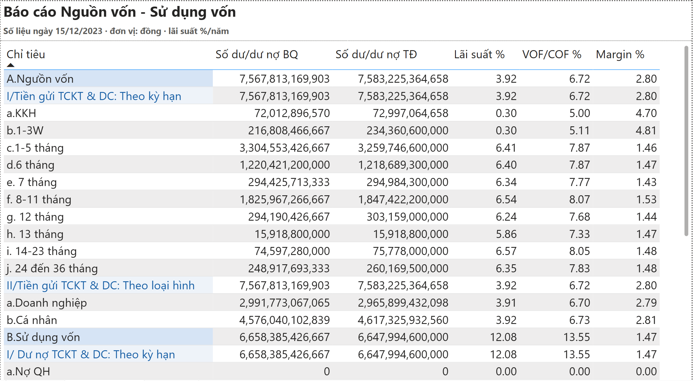
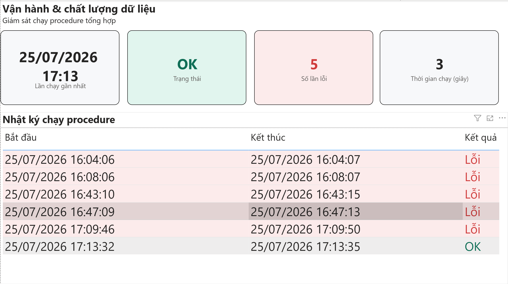

# Hệ thống Báo cáo Nguồn vốn - Sử dụng vốn

Pipeline báo cáo cân đối vốn ngân hàng **end-to-end**: từ dữ liệu giao dịch thô đến dashboard tương tác, chạy tự động hằng ngày, hỗ trợ chạy lại (backdate) và ghi log vận hành.

> Dự án cá nhân · PostgreSQL · PL/pgSQL · Power BI · DAX
👉 **[Xem dashboard tương tác trực tiếp](https://anhvu-lab.github.io/bao-cao-nguon-von-su-dung-von/dashboard_nguon_von.html)**
---

## 🎯 Bài toán

Ngân hàng cần một báo cáo **cân đối vốn** (huy động vs cho vay) chạy hằng ngày, tính **33 chỉ tiêu** theo kỳ hạn và loại hình khách hàng — số dư bình quân, số dư thời điểm, lãi suất, chênh lệch VOF/COF, margin.

Thách thức:
- Đầu vào chỉ là **2 file giao dịch cấp tài khoản** (~1,1 triệu dòng, 365 ngày) và **một báo cáo Excel mẫu** — **không có sẵn công thức tính**.
- Báo cáo phải chạy lại được cho ngày cũ (backdate) khi dữ liệu nguồn thay đổi.
- Cần biết mỗi lần chạy thành công hay lỗi (giám sát vận hành).

## 🔧 Cách làm

**1. Dịch ngược quy tắc nghiệp vụ từ dữ liệu**
Đối chiếu dữ liệu với báo cáo mẫu để tìm ra công thức: cách phân loại 18 bucket kỳ hạn (theo `maturity_date − open_date`), số dư bình quân lũy kế đầu tháng (MTD), lãi suất bình quân, margin. Xử lý cả bản ghi bất thường (sổ tất toán sớm) bằng nhánh phân loại "vét".

**2. Thiết kế mô hình dữ liệu (star schema)**
- Bảng nguồn dùng **generated column** (`day_key` tự sinh từ `process_dt`), **primary key** `(process_dt, account_id)` chống nạp trùng, **khóa ngoại** về dim với "unknown member" (-1), index `(funding_id, process_dt)` hỗ trợ group by.
- `dim_funding_structure`: 33 chỉ tiêu phân cấp cha-con (self-referencing FK), trigger tự cập nhật `rec_updated_dt`.
- `fact_summary_funding_daily`: bảng fact kết quả theo ngày (BQ, TĐ, lãi suất, VOF/COF, margin).

**3. Viết stored procedure (PL/pgSQL)**
Tính toán set-based đổ vào bảng fact, có: **chạy backdate** (xóa + tính lại theo tham số ngày), **ghi log** thời gian/trạng thái/lỗi, **bắt exception** và ném lỗi có kiểm soát cho scheduler.

**4. Dựng dashboard Power BI**
Kết nối qua view, chế độ Import; 3 trang: Tổng quan (KPI, cơ cấu) · Cơ cấu & chi tiết (bảng 33 dòng) · Vận hành (giám sát job). DAX measures, conditional formatting, slicer tương tác.

## 📊 Kết quả

- Số liệu **khớp 100% (33/33 chỉ tiêu)** với báo cáo Excel thủ công gốc.
- Procedure chạy **~0,2 giây/ngày**; backfill cả năm (365 ngày) trong vài phút.
- Báo cáo tự động hóa hoàn toàn, có kiểm soát chất lượng và giám sát lỗi.
- Dashboard cho phép theo dõi **xu hướng, cơ cấu và độ tin cậy dữ liệu** — điều báo cáo Excel một-ngày không làm được.

## 🖼️ Dashboard

**Trang tổng quan** — KPI, LDR, chênh lệch lãi suất, cơ cấu kỳ hạn


**Trang cơ cấu & chi tiết** — báo cáo 33 chỉ tiêu


**Trang vận hành** — giám sát job và chất lượng dữ liệu

## 💡 Điểm nhấn kỹ thuật

**Bảng fact với generated column + PK chống trùng + FK unknown member**
```sql
CREATE TABLE fact_dp_customer (
    day_key int4 GENERATED ALWAYS AS (
        (extract(year  from process_dt)*10000
       + extract(month from process_dt)*100
       + extract(day   from process_dt))::int4) STORED,   -- YYYYMMDD tự sinh
    process_dt    date NOT NULL,
    account_id    int8 NOT NULL,
    ...
    funding_id    int4 NOT NULL DEFAULT -1
                  REFERENCES dim_funding_structure(funding_id),
    CONSTRAINT pk_fact_dp_customer PRIMARY KEY (process_dt, account_id)
);
```

**Dịch ngược quy tắc phân loại kỳ hạn thành CASE (đã kiểm chứng khớp báo cáo)**
```sql
d.funding_code = CASE
    WHEN f.maturity_date IS NULL                          THEN 'DP01001'  -- KKH
    WHEN f.maturity_date - f.open_date BETWEEN 1   AND 24  THEN 'DP01002'  -- 1-3 tuần
    WHEN f.maturity_date - f.open_date BETWEEN 25  AND 165 THEN 'DP01003'  -- 1-5 tháng
    ...
    ELSE 'DP010010'   -- 24-36 tháng: nhánh vét, hứng cả bản ghi bất thường
END
```

**Procedure: chạy lại (backdate) + bắt lỗi + ghi log**
```sql
BEGIN            -- khối con: toàn bộ xử lý
    DELETE FROM fact_summary_funding_daily WHERE process_dt = vProcess_dt;  -- backdate
    INSERT INTO fact_summary_funding_daily (...) SELECT ...;                -- tính set-based
EXCEPTION WHEN OTHERS THEN
    GET STACKED DIAGNOSTICS vErrMsg = MESSAGE_TEXT, vErrContext = PG_EXCEPTION_CONTEXT;
END;
INSERT INTO procedure_log(...) VALUES (..., vErrMsg IS NULL, ...);   -- log mọi lần chạy
IF vErrMsg IS NOT NULL THEN COMMIT; RAISE EXCEPTION '... %', vErrMsg; END IF;
```

👉 Xem code đầy đủ trong thư mục [`sql/`](sql/).

## 🛠️ Công cụ

| Nhóm | Công nghệ |
|---|---|
| Cơ sở dữ liệu | PostgreSQL |
| ETL / Procedure | PL/pgSQL (stored procedure, backdate, logging, exception handling) |
| Mô hình dữ liệu | Dimensional modeling (star schema), generated column, PK/FK, trigger |
| BI / Trực quan hóa | Power BI, DAX, Power Query |
| Khác | Git, SQL nâng cao (CTE, LATERAL join, window/aggregate) |

---

## Cấu trúc thư mục

```
miniproject/
├── README.md                        # tài liệu tổng quan (file này)
├── PRD.md                           # product requirements document
├── data_lineage.md                 # dòng chảy dữ liệu nguồn → dashboard
├── sql/
│   ├── 01_ddl_dim_fact_log.sql      # dim, trigger, 2 fact input, summary, log
│   ├── 02_procedure_backdate.sql    # procedure tổng hợp (backdate + log)
│   ├── 03_report_query_and_checks.sql  # query báo cáo + kiểm tra sau import
│   └── 04_view_powerbi.sql          # view kết nối Power BI
├── powerbi/
│   └── dax_measures.md              # toàn bộ measure & calculated column DAX
└── docs/
    └── huong_dan_powerbi_dashboard.md  # hướng dẫn dựng dashboard chi tiết
```

## Cách chạy nhanh

```bash
psql -d <db> -f sql/01_ddl_funding_report.sql          # tạo bảng
# import CSV bằng \copy ...
psql -d <db> -c "CALL dwh.fct_funding_daily_prc('2023-12-15');"   # chạy 1 ngày
psql -d <db> -f sql/04_report_query.sql                # xuất báo cáo
```

---

*Dữ liệu trong repo là dữ liệu mẫu/mô phỏng, không chứa thông tin thật của khách hàng.*
